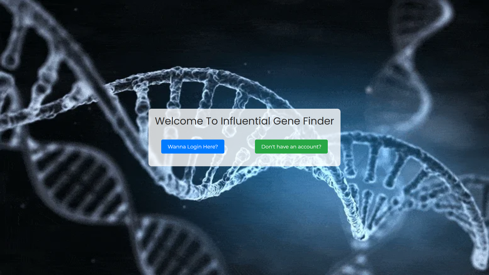
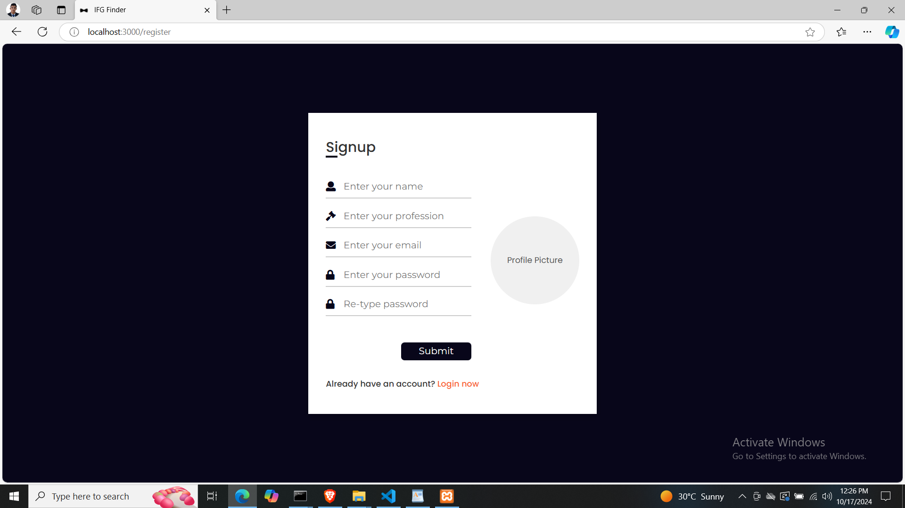
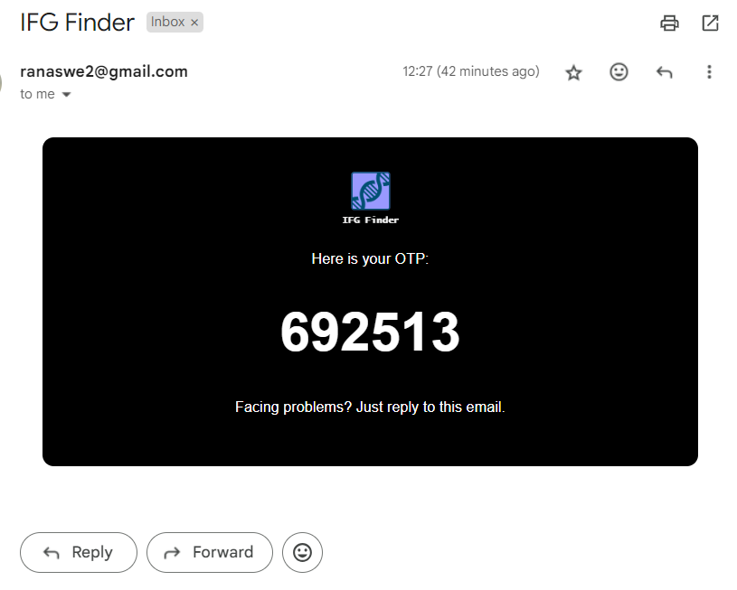
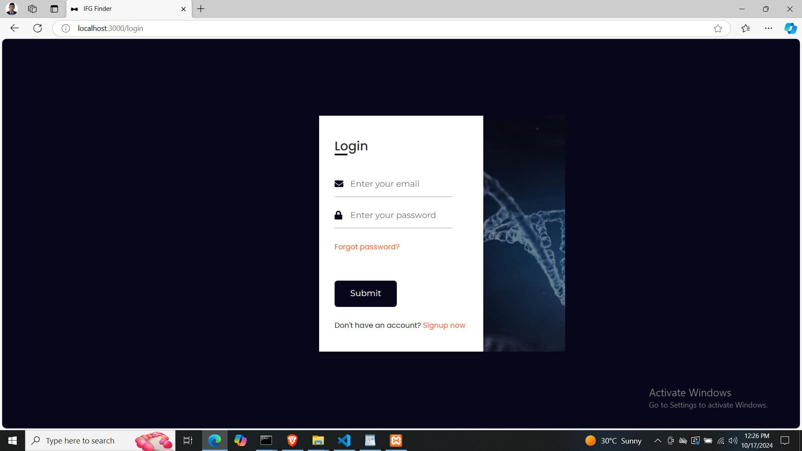
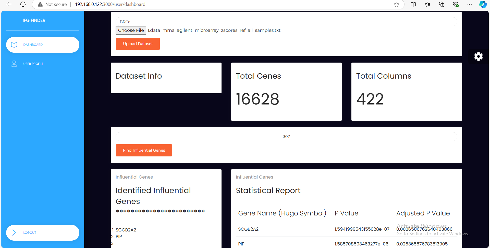
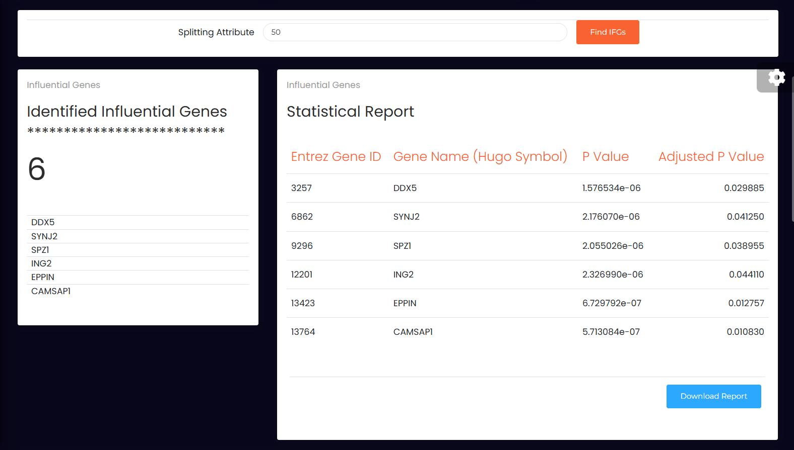
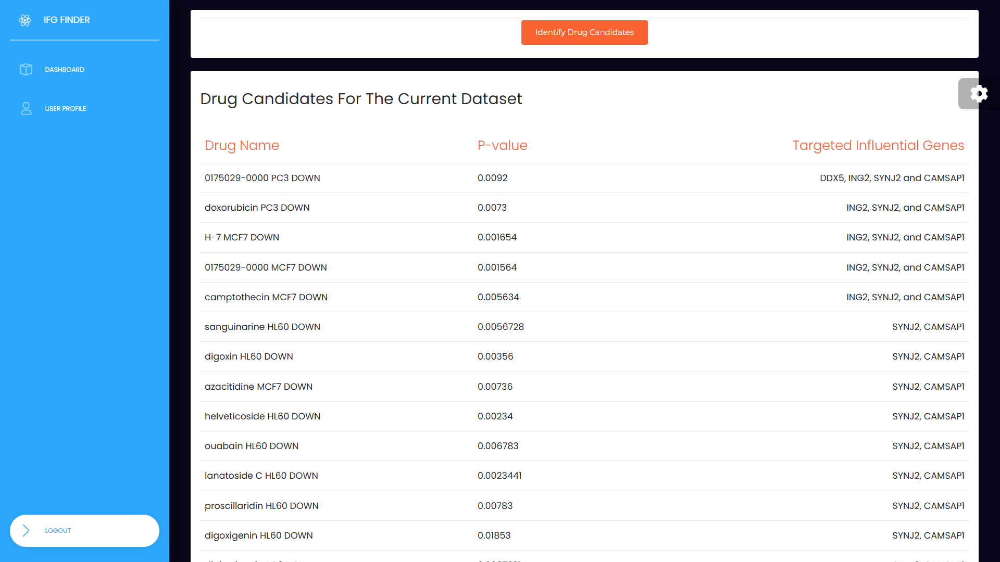
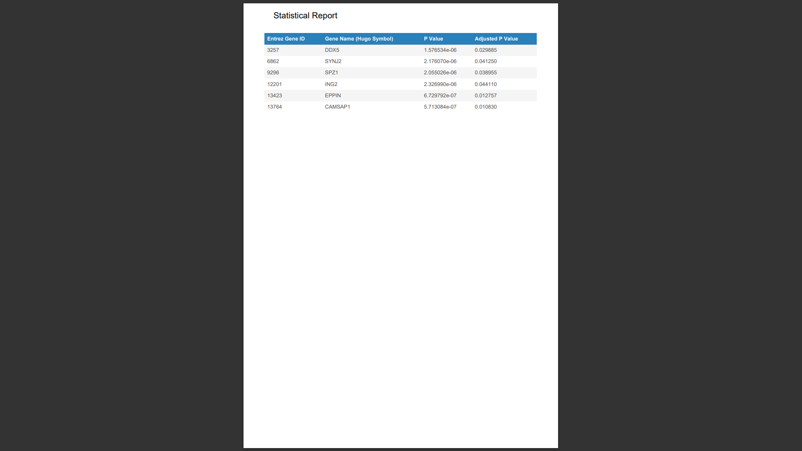
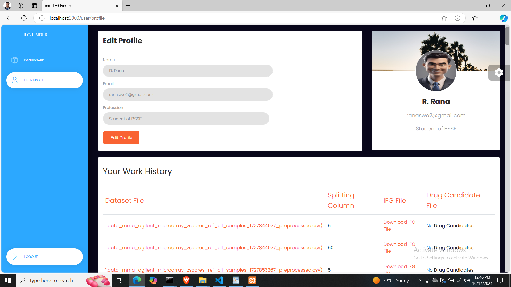

# Introduction
Cancer is one of the major public health threats and potentially fatal diseases worldwide. So,
our goal in this project is to identify influential genes associated with cancer as well as explore
potential drug candidates using a combination of statistical and machine learning methods.
We conducted extensive analysis using microarray data from The Cancer Genome Atlas
(TCGA) dataset, derived from a comprehensive repository of genomic and clinical
information called cBioPortal to uncover genetic signatures involved in cancer development
and progression. We have applied some advanced statistical techniques such as
Kruskal-Wallis H test and Bonferroni correction methods to identify key genetic aberrations.
After that, we identified potential drug candidates by utilizing the identified IFGs by setting
the p-value < 0.05 and the highest number of IFGs enriched with each drug utilizing the
DSigDB database from Enrichr.

# How to Run
* To run the back-end (Django) project, install python3 and nodeJS, start MySQL server. Then open command prompt in the ifg-finder-back project folder and then execute Django run command "py manage.py runserver".
* To run the front-end (ReactJS) project, open command prompt in the ifg-finder-front project folder and then execute ReactJS run command "npm start"

# Application Overview
## Home Page 

## Registration

## Account Verification

## Login

## Dashboard

## Influential Genes

## Drug Candidates

## Statistical Report

## User Profile & History

